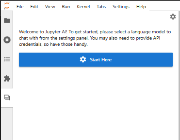
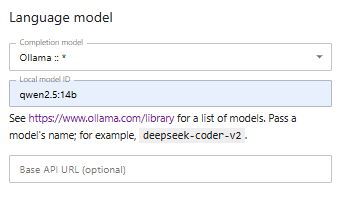
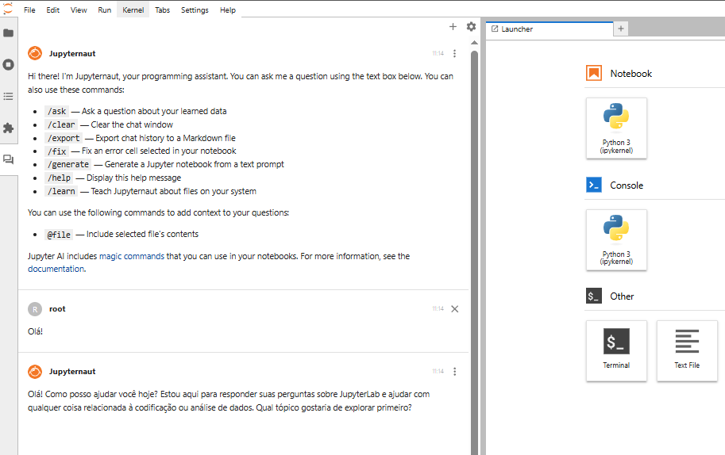
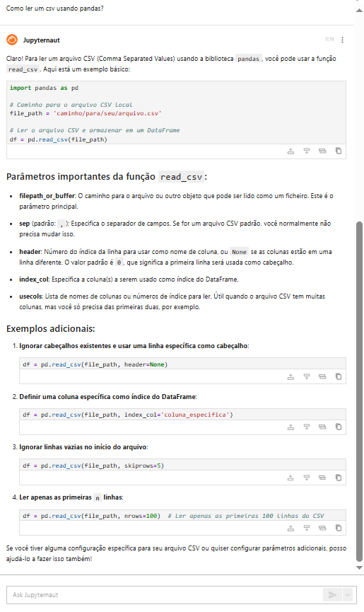
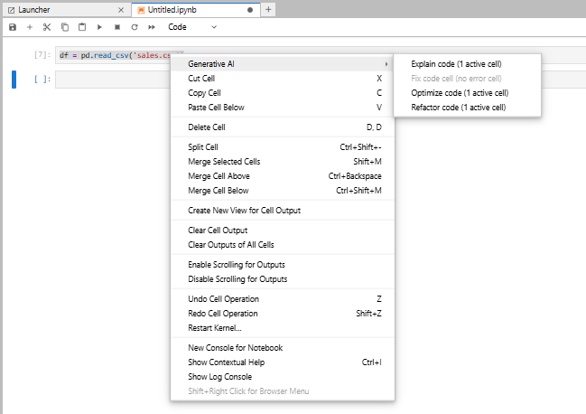
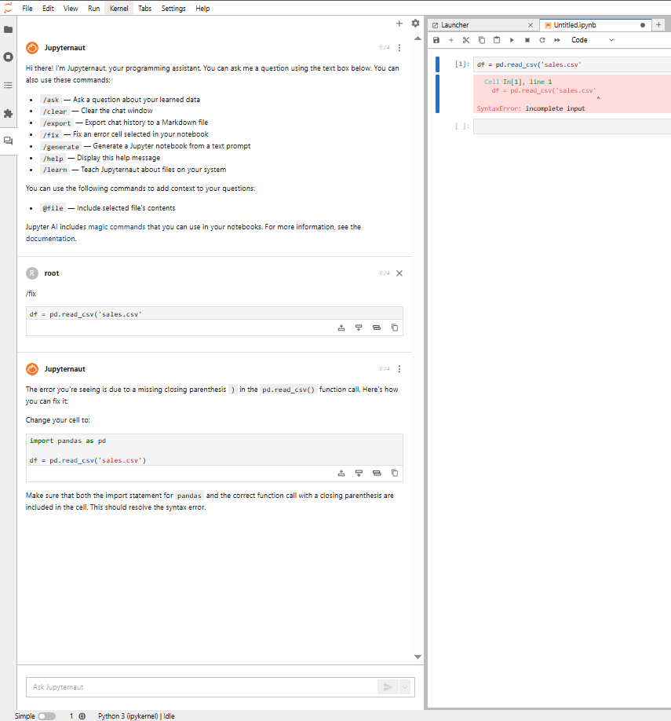
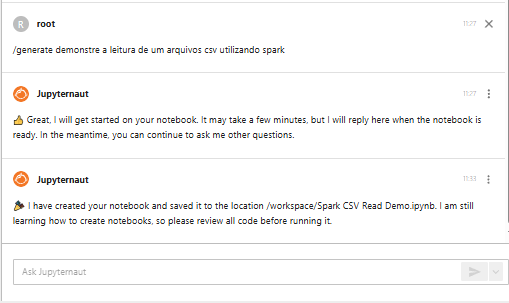
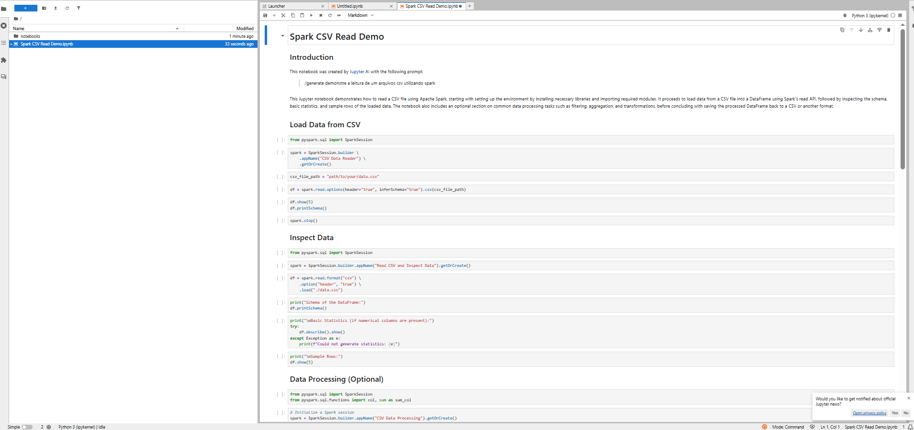

# 💡 IA generativa no Jupyter JupyterLab + Jupyter AI

Este projeto configura um ambiente de **JupyterLab com suporte a LLMs locais usando [Ollama](https://ollama.com/)**, integrando com o [Jupyter AI](https://github.com/jupyterlab/jupyter-ai) para permitir interação com modelos via chat.

## 🧱 Tecnologias

- 🧪 JupyterLab
- 🧠 Ollama (modelos LLM locais como `llama3`, `mistral`, etc.)
- 🐳 Docker + Docker Compose

---

## 🚀 Como usar

### 1. Pré-requisitos

- [Docker](https://www.docker.com/)
- [NVIDIA Container Toolkit](https://docs.nvidia.com/datacenter/cloud-native/container-toolkit/install-guide.html) (se quiser usar GPU)

---

### 2. Suba os containers

```bash
docker compose up --build
```

### 3. Instale algum modelo no ollama

```bash
ollama pull qwen2.5:14b
```

### 3. Acesse o JupyterLab

```bash
http://localhost:8888
```

### 3. Acesse o menu Jupyter AI Chat


### 4. Defina o modelo instalado e salve


### 5. Agora é possível interagir com o chat



## A interface de bate-papo, seu assistente de IA
A interface de bate-papo conecta você ao Jupyternaut, um agente conversacional que utiliza o modelo de linguagem de sua escolha.

O Jupyternaut se comunica principalmente por texto e também pode interagir com arquivos dentro do JupyterLab. Ele responde a perguntas como um assistente de IA geral, incorpora trechos dos seus notebooks nas respostas, insere resultados gerados pela IA diretamente nos seus notebooks, aprende com seus arquivos locais e pode até gerar notebooks a partir de um simples comando.

Importante: o Jupyternaut só acessa as informações que você compartilha explicitamente via comandos de bate-papo, garantindo a privacidade dos seus dados.

Para começar, basta fazer uma pergunta ao Jupyternaut:



Podemos selecionar um trecho de código e pedir para o agente explicar, otimizar ou refatorar o trecho selecionado.



Com o comando ```/fix```, o agente identifica o erro no código e sugere a correção.



Com o comando ```/generate```, o agente é capaz de gerar um notebook a partir de um prompt de texto (esse processo pode levar alguns minutos).



Resultado:




Para mais funcionalidades: [Documentação JupyterAI](https://jupyter-ai.readthedocs.io/en/latest/users/index.html#model-providers)
